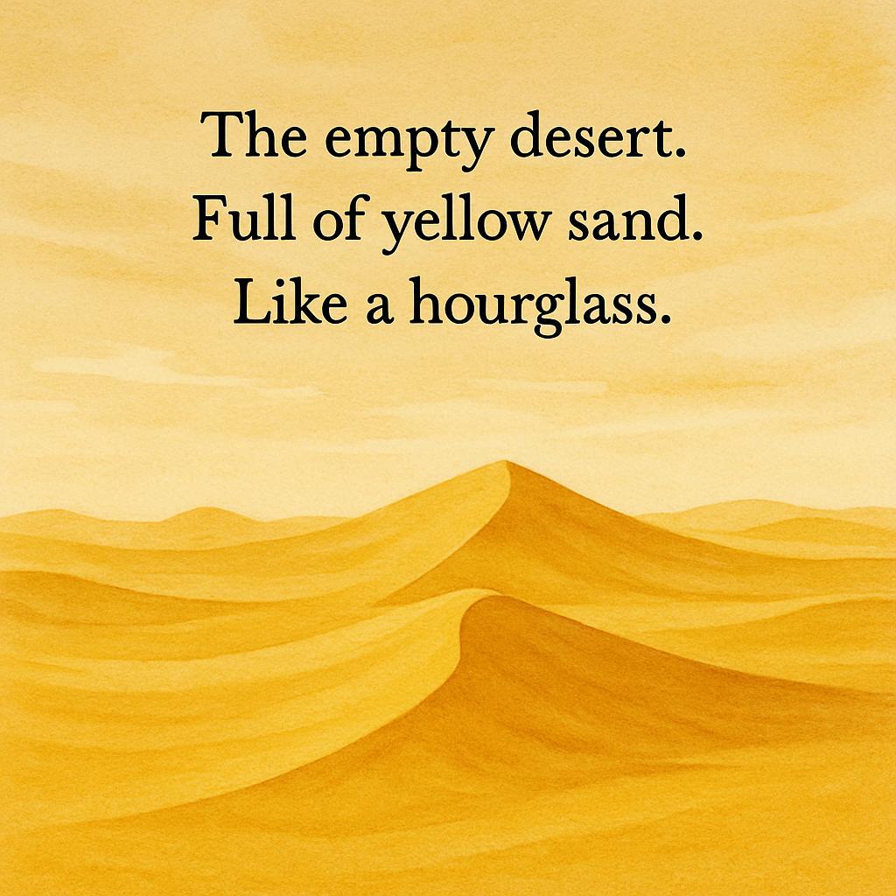

# The poet and the AI

A haikai is a traditional Japanese poem with a 5-7-5 syllables format. Commonly it contains themes like nature, capturing a moment or a landscape. Its message is simple, and has to be expressed with few words. No title, no rhyme, only feelings of the moment.

> Old mountain
> Goes high up in the sky
> Getting old

## Simple

```
http GET localhost:9010/haikais/simple
```

```json
{
  "content": "Mountains grin wide\nAI codes with me—cheerful\npeaks applaud each commit",
  "genre": "Playful",
  "language": "en-GB",
  "theme": "Mountains and programming with AI",
  "title": "Peaks and Commits"
}
```


## Complex

```
> http POST localhost:9010/haikais/complex genre="Sci-Fi" theme="Artificial Intelligence" language="en-GB"
```

```json
{
    "content": "AI learns in silence\nfrom drifting data constellations—\nholds our futures steady",
    "genre": "Sci-Fi",
    "language": "en-GB",
    "theme": "Artificial intelligence",
    "title": "Constellation Quiet"
}
```


## Image generation

```
--enable-native-access=ALL-UNNAMED
```

```
http://localhost:9010/haikais/image/The%20empty%20desert.Full%20of%20yellow%20sand.Like%20a%20hourglass
```




## Actors

```
http GET localhost:9010/actors/filmography/Kevin%20Bacon
```

```json
{
    "films": [
        {
            "director": "Nicole Kassell",
            "role": "Bob",
            "title": "The Woodsman",
            "tmdbId": 4175,
            "year": 2004
        },
        {
            "director": "Antonio Giménez Rico",
            "role": "Edward",
            "title": "The Disappearance of Garcia Lorca",
            "tmdbId": 5953,
            "year": 1997
        },
        {
            "director": "Alan Parker",
            "role": "Lt. R. Anderson",
            "title": "Mississippi Burning",
            "tmdbId": 12033,
            "year": 1988
        },
        {
            "director": "Rob Reiner",
            "role": "Lt. Daniel Kaffee",
            "title": "A Few Good Men",
            "tmdbId": 619,
            "year": 1992
        },
        {
            "director": "Kevin Smith",
            "role": "Steve Gold",
            "title": "Jersey Girl",
            "tmdbId": 12376,
            "year": 2004
        },
        {
            "director": "Cynthia Verges",
            "role": "Keith",
            "title": "Loverboy",
            "tmdbId": 10820,
            "year": 1989
        },
        {
            "director": "John Landis",
            "role": "Chip Diller",
            "title": "Animal House",
            "tmdbId": 9469,
            "year": 1978
        },
        {
            "director": "Lee Tamahori",
            "role": "Richard Attenborough",
            "title": "The Edge",
            "tmdbId": 4016,
            "year": 1997
        },
        {
            "director": "John McNaughton",
            "role": "Tommy",
            "title": "Wild Things",
            "tmdbId": 12109,
            "year": 1998
        },
        {
            "director": "Shane Black",
            "role": "Marv",
            "title": "Kiss Kiss Bang Bang",
            "tmdbId": 5081,
            "year": 2005
        },
        {
            "director": "Marc Sch?l?ndorff",
            "role": "John R. Scott",
            "title": "Murder in the First",
            "tmdbId": 5950,
            "year": 1995
        },
        {
            "director": "Paul Verhoeven",
            "role": "Sebastian Caine",
            "title": "Hollow Man",
            "tmdbId": 2910,
            "year": 2000
        },
        {
            "director": "Herbert Ross",
            "role": "William 'Bubba' Higgins",
            "title": "Footloose",
            "tmdbId": 1655,
            "year": 1984
        },
        {
            "director": "Justin Zackham",
            "role": "George",
            "title": "The Big Wedding",
            "tmdbId": 207643,
            "year": 2013
        },
        {
            "director": "Joel Schumacher",
            "role": "Jake Brigance",
            "title": "A Time to Kill",
            "tmdbId": 11268,
            "year": 1996
        },
        {
            "director": "Terry Green",
            "role": "Detective",
            "title": "Quicksand: No Escape",
            "tmdbId": 621362,
            "year": 2021
        },
        {
            "director": "Garry Marshall",
            "role": "Jack",
            "title": "The Letdown",
            "tmdbId": 206981,
            "year": 2013
        },
        {
            "director": "David Koepp",
            "role": "Himself",
            "title": "You Should Have Left",
            "tmdbId": 584074,
            "year": 2020
        },
        {
            "director": "Glenn Ficarra",
            "role": "Jacob",
            "title": "Crazy, Stupid, Love",
            "tmdbId": 594970,
            "year": 2011
        },
        {
            "director": "Kevin Williamson",
            "role": "Mark",
            "title": "The Following",
            "tmdbId": 254048,
            "year": 2013
        }
    ],
    "name": "Kevin Bacon"
}
```
| Year | Title                             | Role                    | Director             | TMDB ID | Checks |
|:----:|-----------------------------------| ----------------------- | -------------------- |:-------:|--------|
| 1978 | Animal House                      | Chip Diller             | John Landis          |  9469   |        |
| 1984 | Footloose                         | William "Bubba" Higgins | Herbert Ross         |  1655   |        |
| 1988 | Mississippi Burning               | Lt. R. Anderson         | Alan Parker          |  12033  |        |
| 1989 | Loverboy                          | Keith                   | Cynthia Verges       |  10820  |        |
| 1992 | A Few Good Men                    | Lt. Daniel Kaffee       | Rob Reiner           |   619   |        |
| 1995 | Murder in the First               | John R. Scott           | Marc Schölöndorff    |  5950   |        |
| 1996 | A Time to Kill                    | Jake Brigance           | Joel Schumacher      |  11268  |        |
| 1997 | The Disappearance of Garcia Lorca | Edward                  | Antonio Giménez Rico |  5953   |        |
| 1997 | The Edge                          | Richard Attenborough    | Lee Tamahori         |  4016   |        |
| 1998 | Wild Things                       | Tommy                   | John McNaughton      |  12109  |        |
| 2000 | Hollow Man                        | Sebastian Caine         | Paul Verhoeven       |  2910   |        |
| 2004 | The Woodsman                      | Bob                     | Nicole Kassell       |  4175   |        |
| 2004 | Jersey Girl                       | Steve Gold              | Kevin Smith          |  12376  |        |
| 2005 | Kiss Kiss Bang Bang               | Marv                    | Shane Black          |  5081   |        |
| 2011 | Crazy, Stupid, Love               | Jacob                   | Glenn Ficarra        | 594970  |        |
| 2013 | The Big Wedding                   | George                  | Justin Zackham       | 207643  |        |
| 2013 | The Letdown                       | Jack                    | Garry Marshall       | 206981  |        |
| 2013 | The Following                     | Mark                    | Kevin Williamson     | 254048  |        |
| 2020 | You Should Have Left              | Himself                 | David Koepp          | 584074  |        |
| 2021 | Quicksand: No Escape              | Detective               | Terry Green          | 621362  |        |

## Ollama 

```yaml
services:
  ollama:
    image: ollama/ollama
    container_name: ollama
    ports:
      - "11434:11434"
    volumes:
      - ollama:/root/.ollama
    mem_limit: 6g
    restart: unless-stopped
 
volumes:
  ollama:
```

```xml
<dependency>
    <groupId>org.springframework.ai</groupId>
    <artifactId>spring-ai-starter-model-ollama</artifactId>
</dependency>
```

```yaml
ollama:
  chat:
    options:
      model: gemma3:1b
```