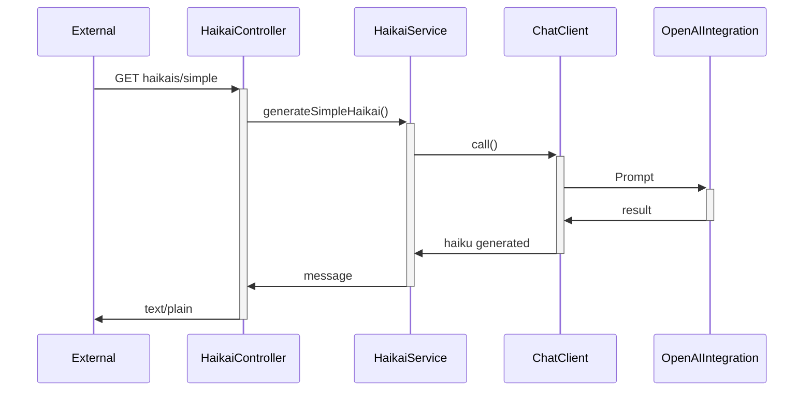
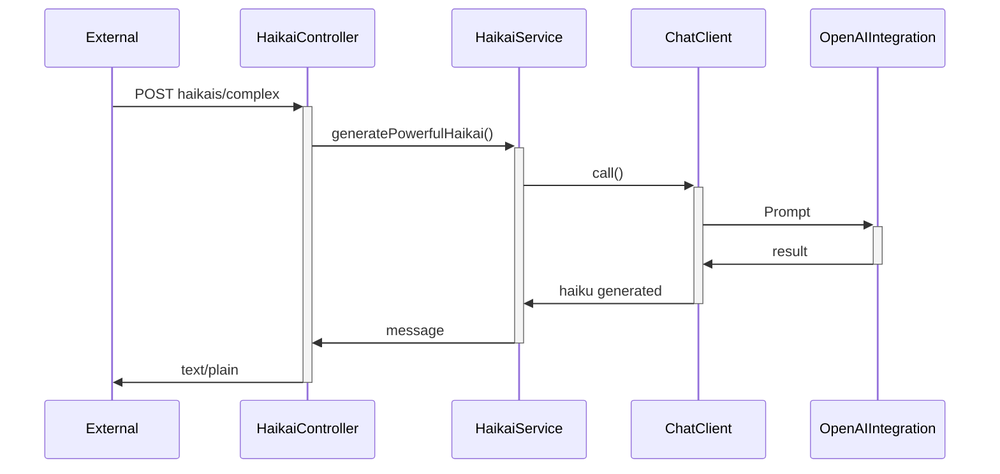
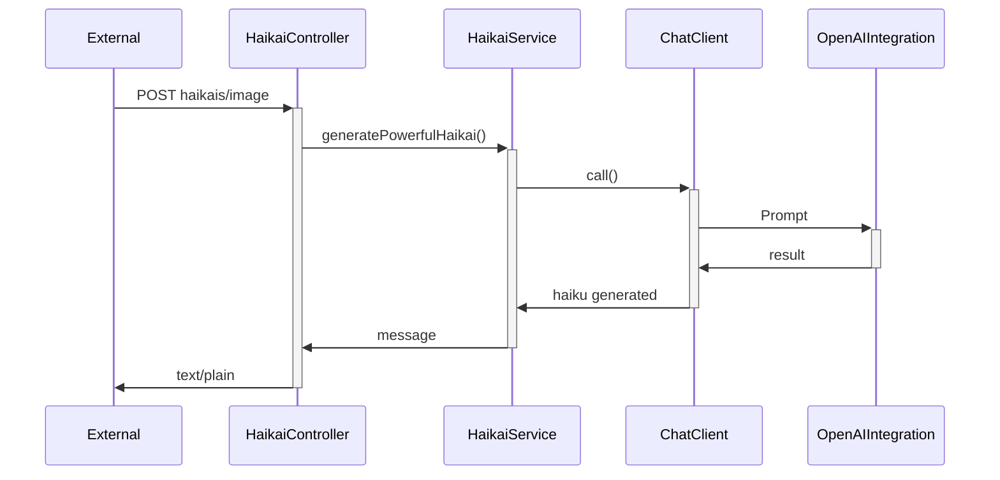
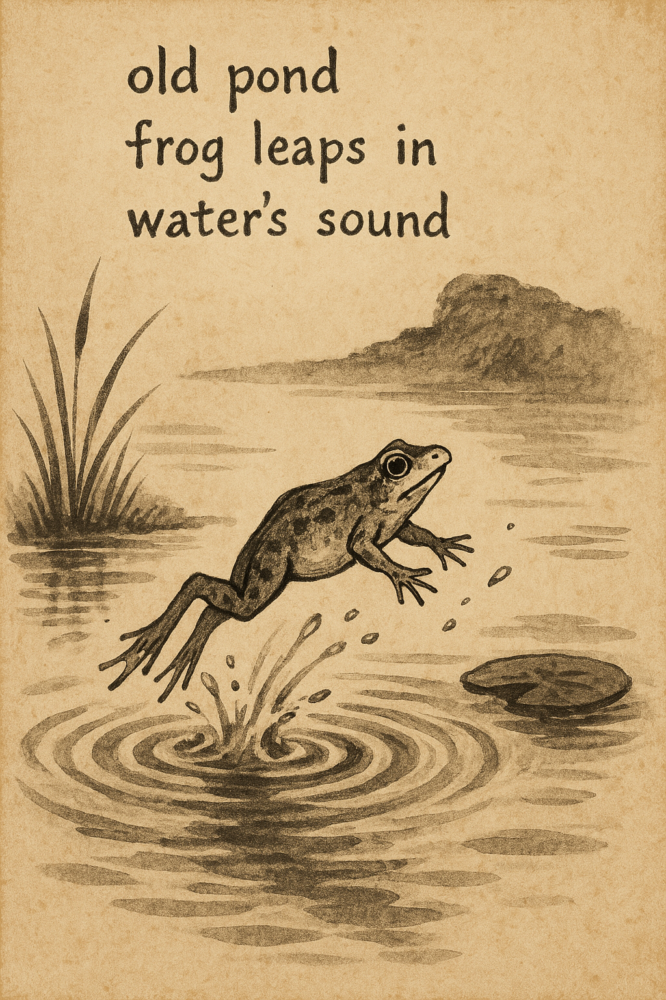
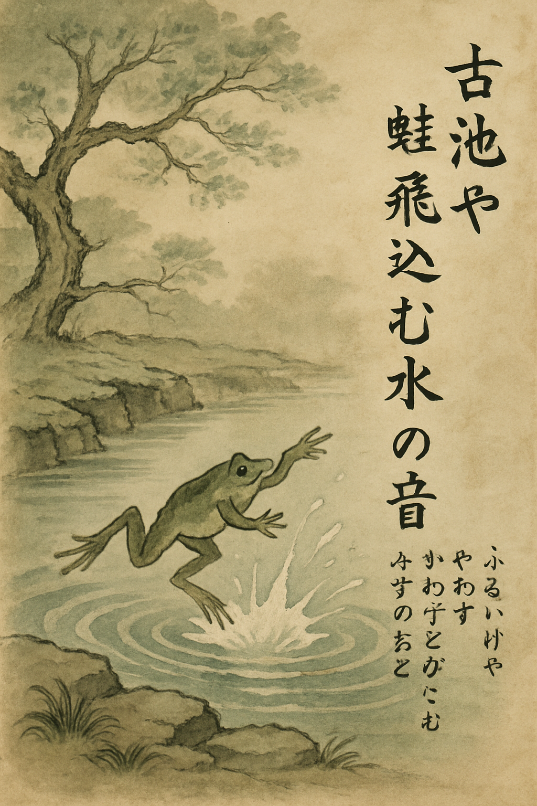
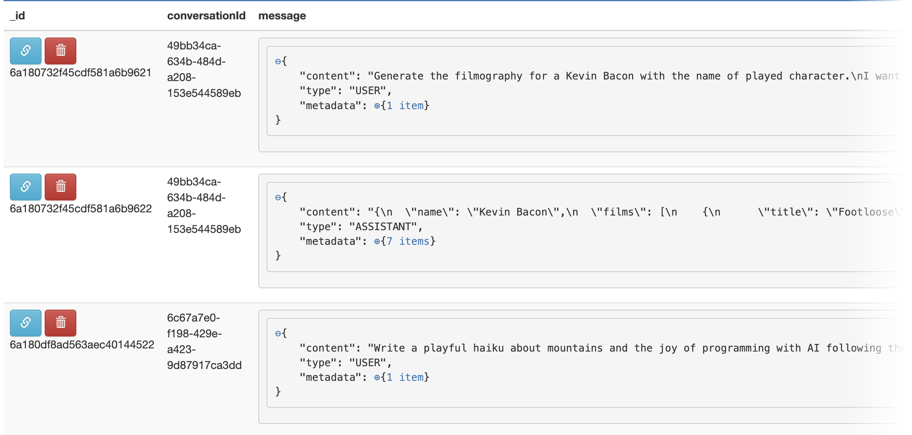

# The poet and the AI

A haikai is a traditional Japanese poem with a 5-7-5 syllables format. Commonly it contains themes like nature,
capturing a moment or a landscape. Its message is simple, and has to be expressed with few words. No title, no rhyme,
only feelings of the moment.

> Old mountain
> Goes high up in the sky
> Getting old

Today they are used in Pop Culture for anything and even AI has the knowledge to create ones. Of course they will not
observe the nature or capture the moment and the landscape, but they have knowledge on what themes are more commonly
used.

This article's example is based upon [Baeldung](https://www.baeldung.com/spring-ai) article (thanks).

This article will show the basic use of Spring Boot AI with Haikus, an actor filmography and MongoDB memory.

---

## The project

The project is located at [Github](https://github.com/ortolanph/haikAI) and it's free to use. It contains a docker
compose file on which will prepare a MongoDB for AI memory.

But wait! Some warmup checks:

1. Get an OPEN AI Key
2. Put some money on it (at least 20 US$, who will pay the AI calls for your professional projects?)
3. The more call you do, more it will spend (be aware)

This project does not spend a lot of money as it does not extensive computations. Expect to spend less than US$ 3.

If you don't wish to spend anything at all, jump to the Ollama section. There I tell how to add Ollama to docker compose
configuration and how to configure on POM and add a configuration on Spring Boot.

To configure with OpenAI integration:

```yaml
spring:
  # (...)
  ai:
    openai:
      api-key: ${OPENAI_API_KEY}
      chat:
        options:
          model: gpt-5.4-nano
          temperature: 1.0
        embedding:
          options:
            model: text-embeddding-3-small
```

On which:
`api-key`: your OpenAI key. Do not share.
`chat.options.mode`: the model of the AI. For this article, gpt-5.4-nano will fit
`chat.options.temperature`: how random will be the answer.
`chat.embedding.options.model`: model to measure the relatedness of text string

On the Java side, I had to configure the ChatClient:

```java
private final ChatClient.Builder chatClientBuilder;

@Bean
public ChatClient chatClient() {
    return chatClientBuilder
            .defaultAdvisors(
                    new SimpleLoggerAdvisor(),
                    MessageChatMemoryAdvisor.builder(mongoChatMemory()).build()
            )
            .build();
}
```

Advisors are special classes that can enhance the chat. For now, I'm using two advisors:

- The `SimpleLoggerAdvisor` that will log every action from AI
- `MessageChatMemoryAdvisor` that will save the conversation between the user and the OpenAI, in this case, using Mongo
  DB. I will explain it later

Refer to [Advisors API](https://docs.spring.io/spring-ai/reference/api/advisors.html) for more information.

## Simple Haikai Service

You can go to the browser, access your favorite AI and time this:

> Write a playful haiku about mountains and the joy of programming with AI following the traditional 5-7-5 syllable
> structure.

But you are a programmer. You know how to develop software (I hope) and you don't bend to AI tools, you delegate to
them, you integrate them into your programs. You know Spring Boot, and them you browse the initilizr front and find
Spring Boot Open AI, which is the dependency to use AI in your project.

Knowing that let's move. Let's examine the diagram below:



This is a pretty straightforward example, nothing uncommon. The code of the service is:

```java
    private static final PromptTemplate SIMPLE_TEMPLATE = new PromptTemplate("Write a playful haiku about mountains and the joy of programming with AI following the traditional 5-7-5 syllable structure.");

private final ChatClient chatClient;
private final UserService userService;

public String generateSimpleHaikai() {
    log.info("HaikaiService:generateSimpleHaikai())");

    return chatClient
            .prompt(SIMPLE_TEMPLATE.create())
            .advisors(a -> a.param(ChatMemory.CONVERSATION_ID, userService.getCustomerId()))
            .call()
            .content();
}

```

I got the response and created an image on ChatGPT. Later on this article, I explain how to generate images with Spring
Boot AI. Here it is the picture:


## Complex

But I wanted more! In the original article I saw that AI can respond within a determined object, so I wrote another
service that writes a parameterized haiku, and returns not only with the content, but withe the parameters and a title.

The prompt used was:

```
Write a {genre} haiku about {theme} following the traditional 5-7-5 syllable structure written {language}.
```

Let's stop for a moment and think: what is `{genre}`, `{theme}` or even `{language}`? They are parameters. The
difference now is that I call a `POST` method that will send me a payload with these three parameters and returns me a
Haikai object.



The method code:

```java
    private static final PromptTemplate COMPLEX_TEMPLATE = new PromptTemplate("Write a {genre} haiku about {theme} following the traditional 5-7-5 syllable structure written {language}.");
private final UserService userService;

public Haikai generatePowerfulHaikai(HaikaiRequest request) {
    log.info("HaikaiService:generatePowerfulHaikai(request={})", request);

    Prompt prompt = COMPLEX_TEMPLATE
            .create(
                    Map.of(
                            "genre", request.genre(),
                            "theme", request.theme(),
                            "language", request.language()));

    return chatClient
            .prompt(prompt)
            .advisors(new SimpleLoggerAdvisor())
            .advisors(a -> a.param(ChatMemory.CONVERSATION_ID, userService.getCustomerId()))
            .call().entity(Haikai.class);
}
```

An example input:

```json
{
  "genre": "Sci-Fi",
  "theme": "Artificial Intelligence",
  "language": "en-GB"
}
```

And an example output:

```json
{
  "content": "AI learns in silence\nfrom drifting data constellations—\nholds our futures steady",
  "genre": "Sci-Fi",
  "language": "en-GB",
  "theme": "Artificial intelligence",
  "title": "Constellation Quiet"
}
```

Again, I pasted the resulting Haikai in a ChatGPT image session and this is the result:


## Image generation

The third example with Haikais is the image generation. Again, this is not a complex thing, but instead using the
ChatClient it will use the `OpenAiImageModel` class instance. This is specific to OpenAI, but implements the ImageModel
interface from Spring Boot AI, which means, where there are implementations. For what I saw, Ollama Spring Boot AI API
does not support image generation.

While testing, a problem occurred and I have to run the application with the JVM Option below:

```
--enable-native-access=ALL-UNNAMED
```

The process is almost the same. Instead calling a chat client, I called the image model to make integration with Open AI:



From Wikipedia

```
http -d -o "haikai.png" POST localhost:9010/haikais/image line1="old pond" line2="frog leaps in" line3="water's sound"
```



From Wikipedia

```
http -d -o "haikai0.png" POST localhost:9010/haikais/image line1="古池や蛙飛び込む水の音" line2="ふるいけやかわずとびこむみずのおと" line3=""
```



## Actors

```
http GET localhost:9010/actors/filmography/Kevin%20Bacon
```

```json
{
  "films": [
    {
      "director": "Nicole Kassell",
      "role": "Bob",
      "title": "The Woodsman",
      "tmdbId": 4175,
      "year": 2004
    },
    {
      "director": "Antonio Giménez Rico",
      "role": "Edward",
      "title": "The Disappearance of Garcia Lorca",
      "tmdbId": 5953,
      "year": 1997
    },
    {
      "director": "Alan Parker",
      "role": "Lt. R. Anderson",
      "title": "Mississippi Burning",
      "tmdbId": 12033,
      "year": 1988
    },
    {
      "director": "Rob Reiner",
      "role": "Lt. Daniel Kaffee",
      "title": "A Few Good Men",
      "tmdbId": 619,
      "year": 1992
    },
    {
      "director": "Kevin Smith",
      "role": "Steve Gold",
      "title": "Jersey Girl",
      "tmdbId": 12376,
      "year": 2004
    },
    {
      "director": "Cynthia Verges",
      "role": "Keith",
      "title": "Loverboy",
      "tmdbId": 10820,
      "year": 1989
    },
    {
      "director": "John Landis",
      "role": "Chip Diller",
      "title": "Animal House",
      "tmdbId": 9469,
      "year": 1978
    },
    {
      "director": "Lee Tamahori",
      "role": "Richard Attenborough",
      "title": "The Edge",
      "tmdbId": 4016,
      "year": 1997
    },
    {
      "director": "John McNaughton",
      "role": "Tommy",
      "title": "Wild Things",
      "tmdbId": 12109,
      "year": 1998
    },
    {
      "director": "Shane Black",
      "role": "Marv",
      "title": "Kiss Kiss Bang Bang",
      "tmdbId": 5081,
      "year": 2005
    },
    {
      "director": "Marc Sch?l?ndorff",
      "role": "John R. Scott",
      "title": "Murder in the First",
      "tmdbId": 5950,
      "year": 1995
    },
    {
      "director": "Paul Verhoeven",
      "role": "Sebastian Caine",
      "title": "Hollow Man",
      "tmdbId": 2910,
      "year": 2000
    },
    {
      "director": "Herbert Ross",
      "role": "William 'Bubba' Higgins",
      "title": "Footloose",
      "tmdbId": 1655,
      "year": 1984
    },
    {
      "director": "Justin Zackham",
      "role": "George",
      "title": "The Big Wedding",
      "tmdbId": 207643,
      "year": 2013
    },
    {
      "director": "Joel Schumacher",
      "role": "Jake Brigance",
      "title": "A Time to Kill",
      "tmdbId": 11268,
      "year": 1996
    },
    {
      "director": "Terry Green",
      "role": "Detective",
      "title": "Quicksand: No Escape",
      "tmdbId": 621362,
      "year": 2021
    },
    {
      "director": "Garry Marshall",
      "role": "Jack",
      "title": "The Letdown",
      "tmdbId": 206981,
      "year": 2013
    },
    {
      "director": "David Koepp",
      "role": "Himself",
      "title": "You Should Have Left",
      "tmdbId": 584074,
      "year": 2020
    },
    {
      "director": "Glenn Ficarra",
      "role": "Jacob",
      "title": "Crazy, Stupid, Love",
      "tmdbId": 594970,
      "year": 2011
    },
    {
      "director": "Kevin Williamson",
      "role": "Mark",
      "title": "The Following",
      "tmdbId": 254048,
      "year": 2013
    }
  ],
  "name": "Kevin Bacon"
}
```

Checks:

* `Y` - The year is correct
* `M` - The movie is correct
* `R` - The role is correct
* `D` - The director is correct
* `T` - The TMDB Id is correct

#### In

| Year | Title                | Role                    | Director          | TMDB ID | Checks |
|:----:|----------------------|-------------------------|-------------------|:-------:|:------:|
| 1978 | Animal House         | Chip Diller             | John Landis       |  9469   | `YMRD` |
| 1984 | Footloose            | William "Bubba" Higgins | Herbert Ross      |  1655   | `YMD`  |
| 1992 | A Few Good Men       | Lt. Daniel Kaffee       | Rob Reiner        |   619   | `YMD`  |
| 1995 | Murder in the First  | John R. Scott           | Marc Schölöndorff |  5950   |  `YM`  |
| 1998 | Wild Things          | Tommy                   | John McNaughton   |  12109  | `YMD`  |
| 2000 | Hollow Man           | Sebastian Caine         | Paul Verhoeven    |  2910   | `YMRD` |
| 2004 | The Woodsman         | Bob                     | Nicole Kassell    |  4175   | `YMD`  |
| 2011 | Crazy, Stupid, Love  | Jacob                   | Glenn Ficarra     | 594970  | `YMD`  |
| 2013 | The Following        | Mark                    | Kevin Williamson  | 254048  | `YMDT` |
| 2020 | You Should Have Left | Himself                 | David Koepp       | 584074  | `YMD`  |

Remarks:

* The Following is a TV Show

#### Not in

| Year | Title                             | Role                 | Director             | TMDB ID | Checks |
|:----:|-----------------------------------|----------------------|----------------------|:-------:|:------:|
| 1988 | Mississippi Burning               | Lt. R. Anderson      | Alan Parker          |  12033  | `YMD`  |
| 1989 | Loverboy                          | Keith                | Cynthia Verges       |  10820  |  `YM`  |
| 1996 | A Time to Kill                    | Jake Brigance        | Joel Schumacher      |  11268  | `YMD`  |
| 1997 | The Disappearance of Garcia Lorca | Edward               | Antonio Giménez Rico |  5953   |        |
| 1997 | The Edge                          | Richard Attenborough | Lee Tamahori         |  4016   | `YMD`  |
| 2004 | Jersey Girl                       | Steve Gold           | Kevin Smith          |  12376  | `YMRD` |
| 2005 | Kiss Kiss Bang Bang               | Marv                 | Shane Black          |  5081   | `YMD`  |
| 2013 | The Big Wedding                   | George               | Justin Zackham       | 207643  | `YMD`  |
| 2013 | The Letdown                       | Jack                 | Garry Marshall       | 206981  |        |
| 2021 | Quicksand: No Escape              | Detective            | Terry Green          | 621362  |  `M`   |

Remarks:

* The Disappearance of Garcia Lorca possible match
  is [Death In Granada](https://www.themoviedb.org/movie/104106-death-in-granada)
* The Letdown appears to be a 2013 show
* Quicksand: No Escape is a 1992 movie

## Ollama

```yaml
services:
  ollama:
    image: ollama/ollama
    container_name: ollama
    ports:
      - "11434:11434"
    volumes:
      - ollama:/root/.ollama
    mem_limit: 6g
    restart: unless-stopped

volumes:
  ollama:
```

```xml

<dependency>
    <groupId>org.springframework.ai</groupId>
    <artifactId>spring-ai-starter-model-ollama</artifactId>
</dependency>
```

```yaml
ollama:
  chat:
    options:
      model: gemma3:1b
```

## Memory

MongoDB

```yaml
ai:
  memory:
    max_messages: 100

spring:
  # (...)
  data:
    mongodb:
      host: localhost
      port: 27019
      database: ai_chat
      username: ai_user
      password: ai_pass
```

```java
    private final MongoChatMemoryRepository mongoChatMemoryRepository;

@Value("${ai.memory.max_messages}")
private int maxMessages;
```

```java
    public ChatMemory mongoChatMemory() {
    return MessageWindowChatMemory
            .builder()
            .chatMemoryRepository(mongoChatMemoryRepository)
            .maxMessages(maxMessages)
            .build();
}
```

```java

@Bean
public ChatClient chatClient() {
    return chatClientBuilder
            .defaultAdvisors(
                    new SimpleLoggerAdvisor(),
                    MessageChatMemoryAdvisor.builder(mongoChatMemory()).build()
            )
            .build();
}
```

```
{
    _id: ObjectId('6a183e208213c918f9860762'),
    conversationId: '788946ac-3c3e-498c-8e9e-01575beb7586',
    message: {
        content: '{\n  "name": "Kevin Bacon",\n  "films": [\n    {\n      "title": "The Woodsman",\n      "year": 2004,\n      "director": "Nicole Kassell",\n      "role": "Bob",\n      "tmdbId": 4175\n    },\n    {\n      "title": "The Disappearance of Garcia Lorca",\n      "year": 1997,\n      "director": "Antonio Giménez Rico",\n      "role": "Edward",\n      "tmdbId": 5953\n    },\n    {\n      "title": "Mississippi Burning",\n      "year": 1988,\n      "director": "Alan Parker",\n      "role": "Lt. R. Anderson",\n      "tmdbId": 12033\n    },\n    {\n      "title": "A Few Good Men",\n      "year": 1992,\n      "director": "Rob Reiner",\n      "role": "Lt. Daniel Kaffee",\n      "tmdbId": 619\n    },\n    {\n      "title": "Jersey Girl",\n      "year": 2004,\n      "director": "Kevin Smith",\n      "role": "Steve Gold",\n      "tmdbId": 12376\n    },\n    {\n      "title": "Loverboy",\n      "year": 1989,\n      "director": "Cynthia Verges",\n      "role": "Keith",\n      "tmdbId": 10820\n    },\n    {\n      "title": "Animal House",\n      "year": 1978,\n      "director": "John Landis",\n      "role": "Chip Diller",\n      "tmdbId": 9469\n    },\n    {\n      "title": "The Edge",\n      "year": 1997,\n      "director": "Lee Tamahori",\n      "role": "Richard Attenborough",\n      "tmdbId": 4016\n    },\n    {\n      "title": "Wild Things",\n      "year": 1998,\n      "director": "John McNaughton",\n      "role": "Tommy",\n      "tmdbId": 12109\n    },\n    {\n      "title": "Kiss Kiss Bang Bang",\n      "year": 2005,\n      "director": "Shane Black",\n      "role": "Marv",\n      "tmdbId": 5081\n    },\n    {\n      "title": "Murder in the First",\n      "year": 1995,\n      "director": "Marc Sch?l?ndorff",\n      "role": "John R. Scott",\n      "tmdbId": 5950\n    },\n    {\n      "title": "Hollow Man",\n      "year": 2000,\n      "director": "Paul Verhoeven",\n      "role": "Sebastian Caine",\n      "tmdbId": 2910\n    },\n    {\n      "title": "Footloose",\n      "year": 1984,\n      "director": "Herbert Ross",\n      "role": "William \'Bubba\' Higgins",\n      "tmdbId": 1655\n    },\n    {\n      "title": "The Big Wedding",\n      "year": 2013,\n      "director": "Justin Zackham",\n      "role": "George",\n      "tmdbId": 207643\n    },\n    {\n      "title": "A Time to Kill",\n      "year": 1996,\n      "director": "Joel Schumacher",\n      "role": "Jake Brigance",\n      "tmdbId": 11268\n    },\n    {\n      "title": "Quicksand: No Escape",\n      "year": 2021,\n      "director": "Terry Green",\n      "role": "Detective",\n      "tmdbId": 621362\n    },\n    {\n      "title": "The Letdown",\n      "year": 2013,\n      "director": "Garry Marshall",\n      "role": "Jack",\n      "tmdbId": 206981\n    },\n    {\n      "title": "You Should Have Left",\n      "year": 2020,\n      "director": "David Koepp",\n      "role": "Himself",\n      "tmdbId": 584074\n    },\n    {\n      "title": "Crazy, Stupid, Love",\n      "year": 2011,\n      "director": "Glenn Ficarra",\n      "role": "Jacob",\n      "tmdbId": 594970\n    },\n    {\n      "title": "The Following",\n      "year": 2013,\n      "director": "Kevin Williamson",\n      "role": "Mark",\n      "tmdbId": 254048\n    }\n  ]\n}',
        type: 'ASSISTANT',
        metadata: {
            role: 'ASSISTANT',
            messageType: 'ASSISTANT',
            refusal: '',
            finishReason: 'STOP',
            annotations: [],
            index: 0,
            id: 'chatcmpl-DkUkTEBzuSeDiyFdKELSgTiEJZ866'
        }
    },
    timestamp: ISODate('2026-05-28T13:07:44.424Z'),
    _class: 'org.springframework.ai.chat.memory.repository.mongo.Conversation'
}
```

